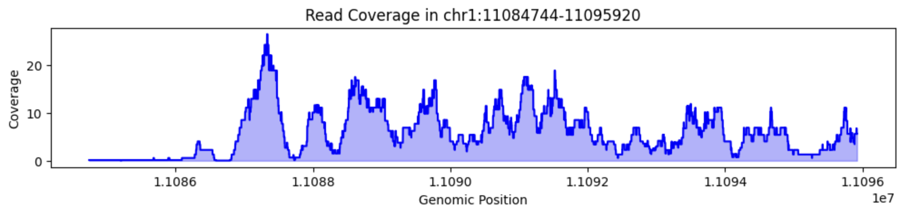
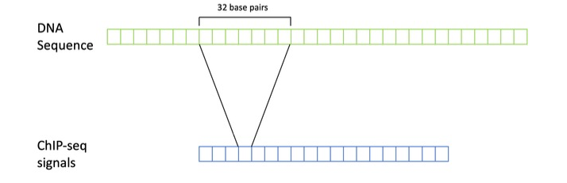
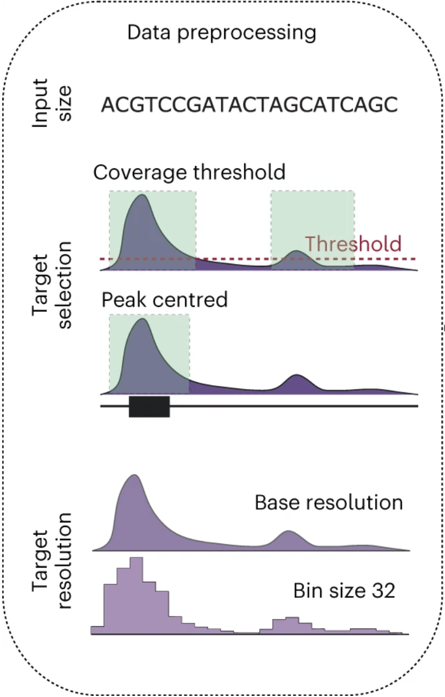
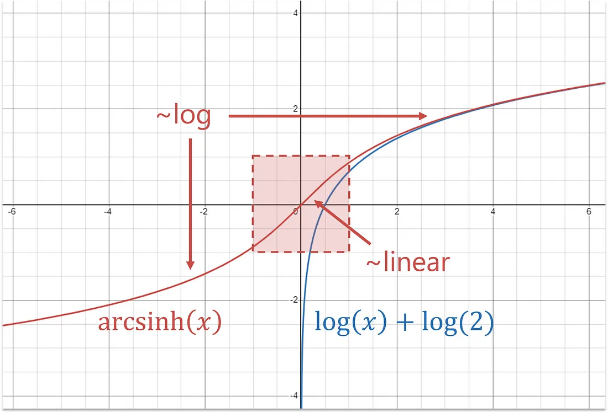

# (PART) Introduction {-}


# Epigenetic Data

## What is epigenetic data?
<br> As you may already know, typically all of the cells in your body contain the same DNA. How, then, do we have different cell types in our body? Your DNA contains a script that is able to produce the proteins required for each specific cell in your body. Which proteins, and subsequently which cells are made, depends on gene expression and regulation, i.e. "the way each cell deploys its genome."^[@ralston2008]

<br>***Epigenetic data*** arises from "the study of heritable and stable changes in gene expression that occur through alterations in the chromosome rather than in the DNA sequence."^[@nora2023] 


<br>

<div style="text-align: center;">
[commonfund.nih.gov](https://commonfund.nih.gov/sites/default/files/epigeneticmechanisms.pdf){target="_blank"}
</div>
<br>
The image above shows quite simply the basics of genetic structures. Cell nuclei contain 23 chromosomes containing our DNA that dictate cellular function. Several more complex processes are involved during cell replication such as DNA transcription and translation in order to make proteins. A key takeaway in coming closer to understanding gene expression is that Chromatin is a complex structure made up of DNA wound around histone proteins, with some segments of DNA being accessible/inaccessible to further processes that determine gene expression, such as transcription factors^[@tf2014]. Euchromatin refers to the accessible state, while Heterochromatin refers to a chromatin state in which DNA cannot be transcribed (inaccessible).^[@shahid2023] Changes to portions of these structures affect which genes can be expressed and at what levels.  There are many different epigenetic modifications that affect chromatin accessibility.

<br>
Some common epigenetic modifications include:

1. **DNA Methylation**: Addition of methyl groups to DNA, affecting gene expression regulation^[@nora2023].
2. **Histone Modifications**: Chemical changes to histone proteins that DNA wraps around, including acetylation, methylation, or phosphorylation. These changes influence chromatin structure and gene accessibility.^[@Kouzarides2007]
3. **Chromatin Accessibility**: Regions of open chromatin that are accessible to transcription factors (special types of proteins that bind to DNA sequences and regulate gene expression) further dictate which regions of DNA can be expressed^[@melanie2021].
<br>

In studying gene expression and epigenetic modifications, we aim to more closely understand the biological mechanisms that regulate development, disease, and how cells respond to epigenetic factors. For example, certain histone modifications have been understood to  regulate the activation or repression of genes that control whether a stem cell becomes a muscle cell, nerve cell, or another specialized type.^[@moritz2020]

<br>

### What Does DNA Look Like?

As illustrated in the image above, DNA is structured as a double helix, with two complementary strands intertwined to form the characteristic helical shape. DNA consists of an extremely long sequence composed of four types of nucleotides: Adenine (A), Cytosine (C), Thymine (T), and Guanine (G).

According to the National Cancer Institute (USA), nucleotides within the DNA double helix form complementary pairs—Adenine pairs with Thymine, and Guanine pairs with Cytosine^[@ncidefinitions]. These pairs are commonly referred to as base pairs (bps). For example, if one strand of the double helix has the sequence "ATCGG", the complementary strand will have the sequence "TAGCC".

Genes are sequences of DNA located at specific positions on chromosomes and can vary in length. Each gene encodes information necessary for producing proteins or RNA molecules, which are essential for the structure, function, and regulation of an organism^[@ncidefinitions]. The complete set of genetic material in an organism is known as its genome.


<div style="text-align: center;">

Image highlighting part of a [dna sequence and base pairs](https://www.researchgate.net/profile/Pratik-Kanani/publication/341901570/figure/fig1/AS:898621708984321@1591259519483/A-human-DNA-and-Part-of-DNA-sequence-28-29.jpg){target="_blank"}.^[@kanani2020]

</div>
<br>


### Common Epigenetic Sequencing Techniques:
1.	***ATAC-Seq*** (Assay for Transposase-Accessible Chromatin with Sequencing):
<br><br>o```      Measures chromatin accessibility to identify open regions of the genome where transcription factors can bind.```
<br><br>o```      Downstream Output: Peaks indicating accessible chromatin regions.```
<br><br>

2. ***ChIP-Seq*** (Chromatin Immunoprecipitation Sequencing):
<br><br>o```      Used to identify DNA regions bound by specific proteins (e.g., transcription factors, histones with specific modifications).```
<br><br>o```      Downstream Output: Peaks indicating binding sites or modification locations.```

## What does epigenetic data look like?

Epigenetic data can be represented in various forms, depending on the type of modification being studied and the methods used to gather the data. **ATAC-Seq** and **ChIP-Seq** are the common methods I will focus on, but there are others that may produce different forms of data, such as WGS (whole-genome sequencing) which produces nucleotide sequencing data, or Bisulfite conversion of DNA producing data on methylation levels across the genome. 


### Representing epigenetic data
<br>
Epigenetic data originates from sequencing methods such as ATAC-Seq or ChIP-Seq experiments. The initial experiments produce raw sequencing reads (fragments), which are then aligned to a reference genome. By aligning these sequences, we can aggregate the reads into regions where they 'pile up' to form peaks, indicating areas of significant biological activity or modification. This can be done per base across the genome, or per gene. Additionally, we could also identify variations in single DNA base pairs called SNPs ([single nucleotide polymorphisms](https://www.cancer.gov/publications/dictionaries/genetics-dictionary/def/single-nucleotide-polymorphism){target="_blank"})^[@ncidefinitions] by examining mismatches where a read’s base differs from the reference genome’s base. This mismatched information can be recorded in a table showing the position, type of mismatch, and the number of reads supporting each mismatch.^[@akalin2020]

<br>


<div style="text-align: center;">

Image showing the [sequencing pipeline](https://compgenomr.github.io/book/images/HTseq.png){target="_blank"} from high-throughput sequencing methods, and how reads ‘pile up’ to form peaks^[@akalin2020].

</div>


<br><br>
1.	***Raw Sequence Reads:***
<br><br>o```      These are the basic output of sequencing experiments, such as those from ChIP-Seq or ATAC-Seq.```
<br><br>o```      Reads are processed and aligned to a reference genome before undergoing peak calling.```
<br><br>

Lets look at what a few lines of raw sequence read data consists of: 
The data is taken from Encode Experiment [ENCSR817LUF](https://www.encodeproject.org/experiments/ENCSR817LUF/){target="_blank"} (chIP-Seq). The accession ID of the raw sequence read data is [ENCFF397NRK](https://www.encodeproject.org/files/ENCFF397NRK/){target="_blank"}. Genomic data comes in many file formats. This specific raw sequence read data is a compressed FASTQ file.

```{r setup-python, include=FALSE}
knitr::opts_chunk$set(echo = FALSE)
library(reticulate)
use_virtualenv("notebook_tutorials/venv")
```

Note: The script I used involved streaming the data directly from a URL using the requests library. While files containing genomic data are generally quite large, for computational efficiency it is recommended that data be downloaded locally.

```{python echo=FALSE}
import gzip
from Bio import SeqIO
import requests
import io

# Define the URL of the FASTQ file
url = "https://www.encodeproject.org/files/ENCFF397NRK/@@download/ENCFF397NRK.fastq.gz"

# Stream the file from the URL
response = requests.get(url, stream=True)
if response.status_code == 200:
    # Use BytesIO to handle the file content in memory
    with io.BytesIO(response.content) as file_content:
        with gzip.open(file_content, "rt") as handle:
            for i, record in enumerate(SeqIO.parse(handle, "fastq")):
                if i >= 3:
                    break
                print(f"ID: {record.id}")
                print(f"Sequence: {record.seq}")
                print(f"Quality Scores: {record.letter_annotations['phred_quality']}")
                print()  # Newline for better readability
else:
    print(f"Failed to retrieve the file: Status code {response.status_code}")

```

As you can see, each data entry is a DNA sequence (read). While I'm only showing the first three entries, for each experiment there are millions of sequencing reads. The quality scores indicate the confidence of each base call in the sequence. Higher scores suggest higher confidence. The scores are in Phred format, where a score of 20 corresponds to a 99% base call accuracy, 30 corresponds to 99.9%, 40 corresponds to 99.99%, and so on.^[@green]
<br><br>
2.	***Peak Calling:***
<br><br>o```      A method used to identify regions in the genome where there is significant enrichment of sequencing reads. This indicates the presence of DNA-protein interactions (e.g., transcription factor binding sites or accessible chromatin regions).```
<br><br>o```      Peaks represent areas where epigenetic marks or chromatin accessibility are concentrated.```
<br><br>

A common peak calling algorithm is [MACS2](https://hbctraining.github.io/Intro-to-ChIPseq/lessons/05_peak_calling_macs.html){target="_blank"}. Essentially, aligned sequencing reads are aggregated into regions where they 'pile up' to form peaks as a read count per base. The outputs typically include signal p-values or fold change over control values, representing the expectation of a peak. Signal p-values are negative log transformed resulting in -log10 signal p-values. While MACS2 is traditionally used in ChIP-seq experiments, it is also applied to ATAC-seq to identify significant peaks and assess their enrichment.^[@mistry2022] In ChIP-seq, broad peaks often represent histone modifications covering entire gene bodies, while narrow peaks are indicative of transcription factor binding sites. In ATAC-seq, the peaks primarily reflect regions of open chromatin.^[@wilbanks2010] Peak calling reduces background noise and utilises signal smoothing techniques to more accurately detect peaks. 

<br>

<div style="margin-left: 40px;">
***Representing Peaks:***
<br><br>
o ***P-value or Fold-change:***
<br><br>P-value: Indicates the statistical significance of the peak, helping to distinguish true peaks from background noise.
<br><br>Fold-change: Represents the difference in read density between treated and control samples, indicating the strength of the signal. <br>


This image shows the signal p-value coverage over a small region (11,176bps) in chromosome one from Encode Experiment [ENCSR817LUF](https://www.encodeproject.org/experiments/ENCSR817LUF/){target="_blank"} (The same chIP-Seq experiment we saw the raw sequence reads from). For further context, experiment ENCSR817LUF targets the H3K36me3 histone modification in brain tissue. The experiment aims to map the locations where the H3K36me3 histone modification is present along the genome. Therefore the peaks represent regions of the genome where the the H3K36me3 histone modification is enriched compared to the background or control. The accession ID of the signal p-value data is [ENCFF601VTB](https://www.encodeproject.org/files/ENCFF601VTB/){target="_blank"}. Genomic data comes in many file formats. This specific signal p-value data is a bigWig file.
<br><br>
o ***Types of Peaks:***
<br><br>Categorical Peaks: Simple yes/no indication of a peak’s presence.
<br><br>Continuous Peaks: More nuanced representation that includes the intensity or enrichment level of the peak, often visualized as a signal track.
<br><br>Thresholded/Pseudoreplicated Peaks: Usually categorical, these peaks are of high confidence regions from multiple replicates (experiments) or pseudoreplicates (artificial data splits), to ensure reliability and reproducibility.
</div>

<br>


<div style="text-align: center;">
***Example Data Pipeline***
</div>


<a href="images/chIP-Seq_pipeline.png" target="_blank">
    
</a>


<div style="text-align: center;">
[encodeproject.org](https://www.encodeproject.org/experiments/ENCSR817LUF/){target="_blank"}
</div>

<br>


This is an example data pipeline from Encode Experiment [ENCSR817LUF](https://www.encodeproject.org/experiments/ENCSR817LUF/){target="_blank"}, the same chIP-Seq experiment we saw the raw sequence reads, and signal p-value coverage from. The yellow bubbles represent downloadable data sets of different types, while the blue boxes represent step types (e.g. peak calling). In the left column are multiple data sets of raw sequence reads, which then undergo data quality steps before being aligned (first blue box) to the reference human genome GRCh38 (denoted by ENCFF110MCL below the reads). The next steps include Peak calling (categorical peaks) and signal generation (continuous peaks) to produce the data we normally use in our machine learning models. This data pipeline process aids in normalisation, noise reduction, and dimensionality reduction of the data.

<br>

## Sources of epigenetic data
There are numerous public data banks which contain genomic datasets ready to be downloaded.
<br><br>
[Blueprint](https://projects.ensembl.org/blueprint/){target="_blank"}
<br>
Blueprint's genomic datasets are focused on gene expression in healthy and diseased cells mostly relating to haematopoietic cells (cells which develop into different types of blood cells).
<br>

[Roadmap](https://www.ncbi.nlm.nih.gov/geo/roadmap/epigenomics/){target="_blank"}
<br>
The National Institute of Health's Roadmap Epigenomics Project contains sample datasets from multiple experiments as well as reference and mapping datasets. 
<br>

[Encode](https://www.encodeproject.org/){target="_blank"}
<br>
The Encode Project contains a large amount of publicly available genomic data easily filtered and downloaded. The genomic data used in this markdown book is sourced from Encode.
<br>

The largest genomic data bank is the [UK Biobank](https://www.ukbiobank.ac.uk/){target="_blank"}, however they require that you apply for access to their datasets.
<br>


## UCSC'S Genome Browser

<br>
The UCSC Genome Browser is a tool that allows for the visualisation of many sets of genomic data, especially bigWig files. It offers a large collection of genome assemblies, annotation tracks, and functional data, enabling users to examine gene structures, regulatory elements, and genetic variations. Whether you're investigating gene functions, exploring genetic variants, or studying comparative genomics, the UCSC Genome Browser can be a good resource to begin understanding complex genomic information. It is also possible to load and visualise genomic data from other sources such as Encode. While the visualisations are extensive, as you can explore below, the browser can be quite overwhelming for first time users. 
<br>

<br>
The following is an example of what the same chIP-Seq data targeting the H3K36me3 histone modification in brain tissue looks like using UCSC's Genome Browser. The pseudoreplicated peaks represent categorically, the significant locations along the genome where the H3K36me3 histone modification is present.
<br>

<iframe src="myhtml/ucsc_genome_browser.html" width="100%" height="510"></iframe>
<div style="text-align: center;">
</div>
<div style="text-align: center;">
[UCSC Genome Browser](https://genome.ucsc.edu/cgi-bin/hgTracks?db=hg38&lastVirtModeType=default&lastVirtModeExtraState=&virtModeType=default&virtMode=0&nonVirtPosition=&position=chr1%3A11084744%2D11095920&hgsid=2307713234_Kap236Tjt6ZGnnNrXMkIhq2Ajn27){target="_blank"}
</div>

<br><br>

<br>
The following is an example of ATAC-Seq data from an experiment on T-helper 17 cells (a type of immune system cell). Recall that the ATAC-Seq method aims to find chromatin regions that are accessible for transcription factor binding. The p-value and fold change graphs show continuous peaks, while the IDR thresholded peaks and pseudoreplicated peaks represent the significant locations of accessible chromatin along the genome.
<br>

<iframe src="myhtml/ucsc_gb_atacseq.html" width="100%" height="510"></iframe>
<div style="text-align: center;">
</div>
<div style="text-align: center;">
[UCSC Genome Browser](https://genome.ucsc.edu/cgi-bin/hgTracks?db=hg38&lastVirtModeType=default&lastVirtModeExtraState=&virtModeType=default&virtMode=0&nonVirtPosition=&position=chr1%3A88379533%2D113275174&hgsid=2307721306_mcnECXS4Hy0fNQ4yz3ZQTL7nimkW){target="_blank"}
</div

<br>

# Pre-processing of bigWig files

In Machine Learning tasks, data used to train models are usually sourced from downstream analysis such as p-values and fold change data for several reasons. These include being aligned to a reference genome, and being of higher quality due to the peak calling process. However, sequencing errors and noise can still be present. When using -log10 p-value and fold change data, <u>base pair averaging</u> is commonly used to further reduce this noise by changing the resolution of the data through aggregation. This is additionally done to prepare the data for the window/region size we intend to examine and predict.^[@li2022]

<div style="text-align: center;">

Figure showing a 32 base pair resolution following base pair averaging of ChIP-Seq data^[@patel2024]

</div>
<br>
By applying base pair averaging over a window (e.g. 32bp), you might see that while individual counts vary, there is a broader region where the average read coverage is consistently high, indicating a potential region of interest. The intended effect of base pair averaging is further reducing noise, signal smoothing as well as reducing computational costs due to binning. You generally do not want to predict at a base pair level as there is not much biological relevance to one base pair as opposed to a region (peaks, binding sites, open chromatin regions etc). <br>
<div style="text-align: center;">

<br>


Figure showing some data preprocessing choices in training convolutional neural networks to predict peaks.^[@toneyan2022]

</div>
<br>
An important point to introduce regarding the input size / input window / input sequence length is this is the genomic ‘context’ your model will use to make predictions. For example, a model trained on an input window of 2048bp could be used to predict the centre 32bp (output window) at a 32bp resolution (prediction resolution). This prediction will be based on the genomic information the model  learns from the 2048bp region. Some current models like Basenji and Enformer have input windows in the kbps with prediction resolutions as small as 128bp^[@avsec2021]. The motivation being that the model has a larger ‘context’ in which to learn distal effects/relationships to make predictions. However, the receptive fields of these models need to be large in order to capture these effects. Enformer utilises transformer architecture, while Basenji uses dilated convolutional layers to boost their receptive fields. As you will see in the tutorials, you can re-average your data to a higher base pair average before using it in machine learning models. This can be implemented to decrease dimensionality, reduce computational intensity and tailor the model to understanding regions of a certain scale.
<br><br>

### Transformations to stop extreme p-values
When utilising genomic data which incorporates p-values, it is important to consider and deal with extreme p-values. One way this is done is through using an Arcsinh-transformation (inverse hyperbolic sine). 
<br><br>
$\text{arcsinh}(x) = \ln \left( x + \sqrt{x^2 + 1} \right)$
<br>


The arcsinh-transformation as a logarithmic function helps in reducing the significance of outliers and sequencing errors while maintaining variance by compressing the range of the data. This transformation can be used in the data preprocessing stage. The graph below visualises how the transformation works. While extreme values are transformed logarithmically, the smaller values are barely transformed as the function for smaller values is more linear in nature. 



<div style="text-align: center;">

Plot of [Arcsinh Transformation](https://miro.medium.com/v2/resize:fit:1100/format:webp/1*glJtHk1HRZpYHsk79QxgwQ.png) compared to a log function, made with Desmos. [Source](https://towardsdatascience.com/transform-data-with-hyperbolic-sine-e39e9275b6ba)


</div>
<br>
In the genomic context, beware of normalising using sample statistics such as the mean or standard deviation, before splitting your data to avoid leaky preprocessing effects. The arcsinh function does not depend on sample statistics in normalising the data.
<br>

BigWig files containing signal p-value or fold change data can be quite tricky to deal with. However, libraries such as pyBigWig enable easier access of data. In order to understand how to handle the data pre-processing stage, I have created a jupyter notebook tutorial on Google Colab. The tutorial begins using UCSC's programs to quickly understand the genomic data within BigWigs, before using the pyBigWig library to simply extract BigWig data.<br>

The final part of the tutorial uses the pyBigWig library to load, filter, and split BigWig data into training, validation, and test sets. The data consists of signal p-values from ChIP-seq experiments, processed using the MACS2 tool. We will re-average these signals to a resolution of 32 base pairs. Additionally, we will implement threshold-based filtering and consistent data splits to understand how to ready data for a model.
<br>

<a href="https://colab.research.google.com/drive/1gRjjTHL5RrlDoo1j7BzWqlYlPrBJBO8A?usp=sharing" target="_blank">Tutorial 1: Loading and Pre-Processsing Data from bigWigs (interactive)</a>


<a href="https://nbviewer.org/github/sn2023imperial/genomicsmarkdown/blob/main/notebook_tutorials/Tutorial_1_bigWigs/Tutorial_1_bigWigs.ipynb" target="_blank">Tutorial 1: Loading and Pre-Processsing Data from bigWigs (nbviewer)</a>
<br>


## Data loaders and simplifying pre-processing

Data loaders are scripts/functions to load batches of data into your model. They are crucial in machine learning because they simplify how data is fed into models, making the whole process smoother and more efficient. This becomes especially important with the large datasets used in genomic studies, where managing and processing data manually would be cumbersome. By automating these tasks, data loaders help ensure that data is processed efficiently, allowing for faster and more effective model training. While there are existing github repositories with genomic data loaders, such as ["Kipoi Dataloader"](https://kipoi.org/kipoiseq/dataloaders/){target="_blank"}, and ["Dataloader for BigWig files"](https://github.com/pfizer-opensource/bigwig-loader/blob/main/README.md){target="_blank"}.^[@retel_fast_2024] Depending on the data used and model you build, they won't cover all of the use cases. When building one yourself, the PyTorch library has its own [dataset and dataloader](https://pytorch.org/tutorials/beginner/basics/data_tutorial.html){target="_blank"} modules, which include creating custom datasets.


