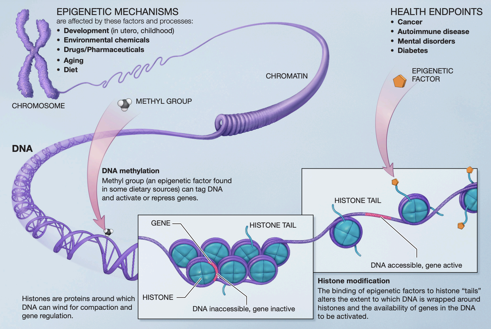
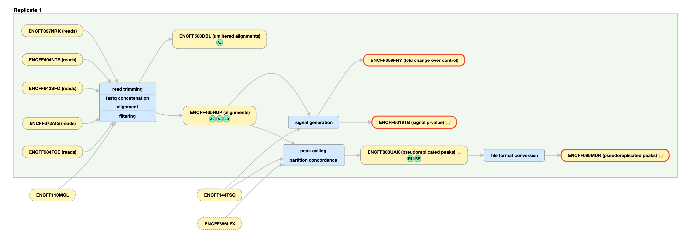

# (PART) Introduction {-}


# Epigenetic Data

## What is epigenetic data?
<br> As you may already know, all of the cells in your body contain the same DNA. How, then, do we have different cell types in our body? Your DNA contains a script that is able to produce the proteins required for each specific cell in your body. Which proteins, and subsequently which cells are made, depends on gene expression, "the way each cell deploys its genome."^[@ralston2008]

<br>***Epigenetic data*** arises from "the study of heritable and stable changes in gene expression that occur through alterations in the chromosome rather than in the DNA sequence."^[@nora2023] 


<br>

<div style="text-align: center;">
[commonfund.nih.gov](https://commonfund.nih.gov/sites/default/files/epigeneticmechanisms.pdf){target="_blank"}
</div>
<br>
The key takeaways from this image:
<br>-Genetic structure of DNA, chromatin, chromosomes
<br>-Understanding histones and DNA accessibility which has implications on gene expression. 

<br>
Some epigenetic alterations include:

1. **DNA Methylation**: Addition of methyl groups to DNA, affecting gene expression regulation^[@nora2023].
2. **Histone Modifications**: Chemical changes to histone proteins that DNA wraps around. These changes influence chromatin structure and gene accessibility.^[@Kouzarides2007]
3. **Chromatin Accessibility**: Regions of open chromatin that are accessible to transcription factors (special types of proteins that bind to DNA sequences and regulate gene expression) further dictate which regions of DNA can be expressed^[@melanie2021].
<br>

### Key Epigenetic Techniques:
1.	***ATAC-Seq*** (Assay for Transposase-Accessible Chromatin with Sequencing):
<br><br>```o      Measures chromatin accessibility to identify open regions of the genome where transcription factors can bind.```
<br><br>```o      Output: Peaks indicating accessible chromatin regions.```
<br><br>

2. ***ChIP-Seq*** (Chromatin Immunoprecipitation Sequencing):
<br><br>```o      Used to identify DNA regions bound by specific proteins (e.g., transcription factors, histones with specific modifications).```
<br><br>```o      Output: Peaks indicating binding sites or modification locations.```

## What does epigenetic data look like?

Epigenetic data can be represented in various forms, depending on the type of modification being studied and the methods used to gather the data. **ATAC-Seq** and **ChIP-Seq** are the common methods I will focus on, but there are others that may produce different forms of data.


### Representing epigenetic data
1.	***Raw Sequence Reads:***
<br><br>```o      These are the basic output of sequencing experiments, such as those from ChIP-Seq or ATAC-Seq.```
<br><br>```o      Reads are processed and aligned to a reference genome before undergoing peak calling.```
<br><br>
2.	***Peak Calling:***
<br><br>```o      A method used to identify regions in the genome where there is significant enrichment of sequencing reads. This indicates the presence of DNA-protein interactions (e.g., transcription factor binding sites) or accessible chromatin regions.```
<br><br>```o      Peaks represent areas where epigenetic marks or chromatin accessibility are concentrated.```
<br><br>

<div style="margin-left: 40px;">
***Representing Peaks:***
<br><br>
- ***P-value or Fold-change:***
<br><br>P-value: Indicates the statistical significance of the peak, helping to distinguish true peaks from background noise.
<br><br>Fold-change: Represents the difference in read density between treated and control samples, indicating the strength of the signal.
<br><br>
- ***Types of Peaks:***
<br><br>Categorical Peaks: Simple yes/no indication of a peak’s presence.
<br><br>Continuous Peaks: More nuanced representation that includes the intensity or enrichment level of the peak, often visualized as a signal track.
</div>

<br>
<div style="text-align: center;">
***Example Data Pipeline***
</div>



<div style="text-align: center;">
[encodeproject.org](https://www.encodeproject.org/experiments/ENCSR817LUF/){target="_blank"}
</div>

<br>
EXPLANATION OF PIPELINE + WHAT DATA WE NORMALLY USE IN ML

<br>

### Example Data Representations:

<br>
The following is an example of what chIP-Seq data looks like using UCSC's Genome Browser. The experiment data comes from the [encodeproject.org](https://www.encodeproject.org/experiments/ENCSR817LUF/){target="_blank"}.
<br>
EXPLANATION OF EXPERIMENT + EXPLAIN GRAPH

<iframe src="http://genome.ucsc.edu/cgi-bin/hgTracks?db=hg38&lastVirtModeType=default&lastVirtModeExtraState=&virtModeType=default&virtMode=0&nonVirtPosition=&position=chr1%3A11084744%2D11095920&hgsid=2307713234_Kap236Tjt6ZGnnNrXMkIhq2Ajn27" width="100%" height="610"></iframe>
<div style="text-align: center;">
</div>
<div style="text-align: center;">
[UCSC Genome Browser](http://genome.ucsc.edu/cgi-bin/hgTracks?db=hg38&lastVirtModeType=default&lastVirtModeExtraState=&virtModeType=default&virtMode=0&nonVirtPosition=&position=chr1%3A11084744%2D11095920&hgsid=2307713234_Kap236Tjt6ZGnnNrXMkIhq2Ajn27){target="_blank"}
</div

<br><br><br><br><br><br><br>

<iframe src="myhtml/encode_browser.html" width="100%" height="800"></iframe>
<div style="text-align: center;">
[encodeproject.org](https://www.encodeproject.org/experiments/ENCSR875FZN/){target="_blank"}
</div>

### Transformations to stop extreme p-values
Arcsinh-transformation


### Epigenetic Data and Gene Expression:

While epigenetic data provides crucial insights into gene regulation, it is not the same as direct measurements of gene expression (such as RNA-Seq data).
Epigenetic modifications can influence gene expression, but they do so by altering the chromatin state and regulatory landscape rather than directly measuring mRNA levels.


## Sources of epigenetic data
Blueprint
Roadmap
Encode (Main Focus)

Handling bigWig files
Data loaders and pre-processing
Dealing with missing data (oversampling, undersampling, weighting)


##testpython code
```{r setup, include=FALSE}
library(reticulate)
use_python("/opt/homebrew/bin/python3")
```

```{python}
import numpy as np
import matplotlib.pyplot as plt

x = np.linspace(0, 10, 100)
y = np.sin(x)

plt.plot(x, y)
plt.xlabel('x')
plt.ylabel('y')
plt.title('Sine Wave')
plt.grid(True)
plt.savefig('images/sine_wave.png')
plt.show()
```

