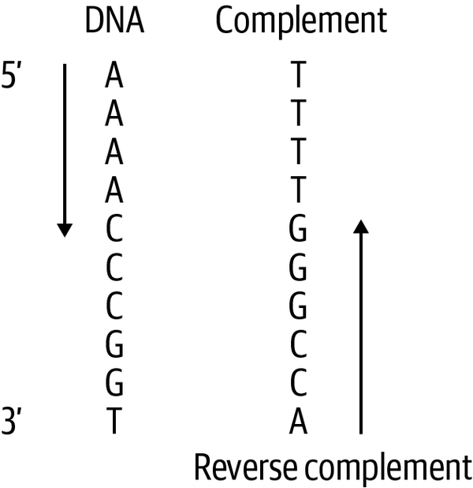

# (PART) Training models with DNA input {-}

# Loss functions, and peak metrics

When selecting the optimal loss function for your machine learning model in genomics, the decision should be informed by the nature of the problem and the specific type of data you're working with. The principles for choosing loss functions in genomics are similar to those in other machine learning contexts. For regression based tasks, while Mean Squared Error (mse) loss functions have been used, models utilising data and making predictions associated with reads or counts use a Poisson loss function. Another two common loss functions include Binary Cross-Entropy loss and Categorical Cross-Entropy loss, when dealing with classification type predictions.^[@patterson2017]<br><br>

**Mean Squared Error (MSE):**
<br><br>
•	<u>Use Case:</u> Regression problems where the goal is to predict continuous values, such as gene expression or coverage levels. <br><br>
<u>Example:</u><br> [DeepImpute](https://genomebiology.biomedcentral.com/articles/10.1186/s13059-019-1837-6){target="_blank"}, a deep neural network-based imputation algorithm that allows for accurate imputation of single-cell RNA-seq data. The model is used to estimate missing or low-quality gene expression values in single-cell RNA sequencing datasets. It uses a "weighted mean squared error (MSE) loss function that gives higher weights to genes with higher expression values. This emphasizes accuracy on high confidence values and avoids over penalizing genes with extremely low values (e.g., zeros)".^[@cedric2019]
<br><br>

**Poisson Loss:**
<br><br>
•	<u>Use Case:</u> Count data where the number of events (e.g., read counts in chIP-seq data) follows a Poisson distribution.<br><br>
<u>Example:</u><br> A deep learning architecture called [Enformer](https://www.nature.com/articles/s41592-021-01252-x){target="_blank"} was used to predict gene expression more accurately in 2021 by integrating long range interactions within the genome. It utilises a [poisson negative log-likelihood loss function](https://pytorch.org/docs/stable/generated/torch.nn.PoissonNLLLoss.html){target="_blank"} resulting in a model that was able to integrate information from up to 100 kilobases away.^[@avsec2021]
<br><br>

**Cross-Entropy Loss:**
<br><br>
•	<u>Use Case:</u> Classification problems where the goal is to predict binary outcomes.
<br><br>
<u>Example:</u><br> A convolutional neural network was employed to create a software pipeline called [CNN-Peaks](https://www.nature.com/articles/s41598-020-64655-4){target="_blank"}, designed to categorically detect ChIP-Seq peaks without relying on traditional peak calling methods or manual inspection. The model utilizes a binary cross-entropy loss function, which was weighted to account for the scarcity of peaks in the data.^[@oh2020]
<br><br>

**Categorical Cross-Entropy Loss:**
<br><br>
•	<u>Use Case:</u> Multi-class classification problems.
<br><br>
<u>Example:</u><br> Researchers developed a combined [model](https://www.ncbi.nlm.nih.gov/pmc/articles/PMC10085982/){target="_blank"} that integrates cell-free DNA (cfDNA) methylation profile data with ATAC-seq data to enhance cancer detection and tissue-of-origin localization. This approach combines both epigenomic and chromatin accessibility information to improve the accuracy of identifying the specific tissue or organ from which a cancerous signal originates. The model employs a categorical cross-entropy loss function within each component to optimize tissue-of-origin localization, allowing it to effectively determine the most likely source of the cancerous signal.^[@bae2017]
<br><br>

In the case of this tutorial and running models to predict continuous coverage values from bigwig p-value datasets, I have opted to use an MSE loss function, however I also compare its results to a model with a Poisson loss function. It is important to remember that “loss functions can penalize the shapes or the magnitudes (for example, the mean squared error (MSE))”^[@toneyan2022] when optimising.


# Training tricks

## Training on reverse complement

As explained in Part 1, DNA has a double helix structure. When we one-hot encode a segment of DNA in our models using a reference genome, we typically represent only one strand of the double helix. The complement of this strand is the opposite strand, where Adenine (A) pairs with Thymine (T), and Cytosine (C) pairs with Guanine (G). The reverse complement of a DNA strand is obtained by first taking its complement and then reading it in the reverse direction.

<br>

<div style="text-align: center;">

This figure shows the reverse complement of a DNA sequence^[@clark2021]

</div><br>

Training on DNA sequences and augmenting the data with their reverse complements has been shown to improve model accuracy, prediction, and interpretability in DNA sequence-related models. This approach involves "treating the reverse complement DNA sequence as another sample" [@cao2019]. By incorporating reverse complements, the model is exposed to a wider variety of sequence patterns, which helps reduce overfitting and enhances generalization. As a result, models become better at recognizing patterns regardless of strand orientation. Although the logic to obtain the reverse complement of a DNA strand is straightforward, the Bio.Seq module from the Biopython library provides a simple way to do this. Augmenting your dataset with reverse complements is usually done to training sets, but can be applied to validation and test sets as well.
<br>

```{python echo=TRUE}
from Bio.Seq import Seq

# Example DNA sequence
dna_sequence = Seq("ATGCGTAC")

# Generate the reverse complement
reverse_complement = dna_sequence.reverse_complement()

print("Original Sequence: ", dna_sequence)
print("Reverse Complement: ", reverse_complement)
```

<br>

##Training on sequence shifts
<br>
Training on small, random sequence shifts up and downstream by shifting the genomic coordinates of the input sequence is also known as jitter. Jittering adds diversity to the training data by creating slightly different versions of the same sequence. This allows models to be less sensitive to the exact positioning of features, making them more robust to variations in the data. It also allows models to generalise better to unseen data where sites may not always be perfectly aligned. A variation of jittering, called flanking "extends DNA sequences from its midpoint by X base pairs and takes the left, middle and right input windows of the extended sequence as training samples with the same labels, tripling the size of training set.^[@cao2019]
<br>

<u>note:</u><br>
A paper on evaluating deep learning for predicting epigenomic profiles found that models trained with augmentations (reverse complement and jittering), "yielded improved robustness, especially when trained on peak-centered data. On the other hand, models that were trained on coverage-threshold data already benefited from the randomly-centered profiles."^[@toneyan2022]

How many epochs are typically used to train on?
Which learning rates are commonly used?
Hyper-parameter optimisation 
Raytune
Successive halving algorithm (SHA) and Asynchronous SHA (ASHA) - ASHA is one of the current ‘best in class’ hyperparam opt
How to optimise parameters when the models become huge, e.g. Enformer Celltyping
How to do hyperparameter tuning when models become very large


# Choosing which genomic regions to train on

# Effect of differences in sequencing depths

# Reproducibility of machine learning models

## Seeding

## Dashboarding

# Testing
