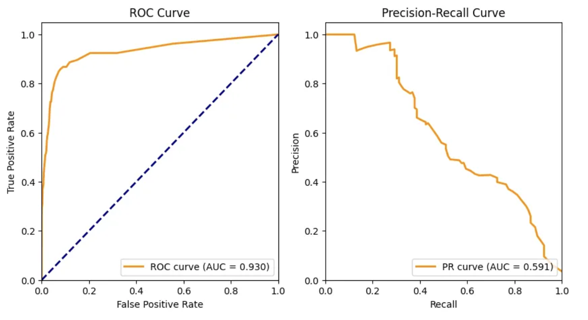

# (PART) Training models with DNA input {-}

# Loss functions, and peak metrics

When selecting the optimal loss function for your machine learning model in genomics, the decision should be informed by the nature of the problem and the specific type of data you're working with. The principles for choosing loss functions in genomics are similar to those in other machine learning contexts. For regression based tasks, while Mean Squared Error (mse) loss functions have been used, models utilising data and making predictions associated with reads or counts use a Poisson loss function. Another two common loss functions include Binary Cross-Entropy loss and Categorical Cross-Entropy loss, when dealing with classification type predictions.^[@patterson2017]<br><br>

**Mean Squared Error (MSE):**
<br><br>
•	<u>Use Case:</u> Regression problems where the goal is to predict continuous values, such as gene expression or coverage levels. <br><br>
<u>Example:</u><br> [DeepImpute](https://genomebiology.biomedcentral.com/articles/10.1186/s13059-019-1837-6){target="_blank"}, a deep neural network-based imputation algorithm that allows for accurate imputation of single-cell RNA-seq data. The model is used to estimate missing or low-quality gene expression values in single-cell RNA sequencing datasets. It uses a "weighted mean squared error (MSE) loss function that gives higher weights to genes with higher expression values. This emphasizes accuracy on high confidence values and avoids over penalizing genes with extremely low values (e.g., zeros)".^[@cedric2019]
<br><br>

**Poisson Loss:**
<br><br>
•	<u>Use Case:</u> Count data where the number of events (e.g., read counts in chIP-seq data) follows a Poisson distribution.<br><br>
<u>Example:</u><br> A deep learning architecture called [Enformer](https://www.nature.com/articles/s41592-021-01252-x){target="_blank"} was used to predict gene expression more accurately in 2021 by integrating long range interactions within the genome. It utilises a [poisson negative log-likelihood loss function](https://pytorch.org/docs/stable/generated/torch.nn.PoissonNLLLoss.html){target="_blank"} resulting in a model that was able to integrate information from up to 100 kilobases away.^[@avsec2021]
<br><br>

**Cross-Entropy Loss:**
<br><br>
•	<u>Use Case:</u> Classification problems where the goal is to predict binary outcomes.
<br><br>
<u>Example:</u><br> A convolutional neural network was employed to create a software pipeline called [CNN-Peaks](https://www.nature.com/articles/s41598-020-64655-4){target="_blank"}, designed to categorically detect ChIP-Seq peaks without relying on traditional peak calling methods or manual inspection. The model utilizes a binary cross-entropy loss function, which was weighted to account for the scarcity of peaks in the data.^[@oh2020]
<br><br>

**Categorical Cross-Entropy Loss:**
<br><br>
•	<u>Use Case:</u> Multi-class classification problems.
<br><br>
<u>Example:</u><br> Researchers developed a combined [model](https://www.ncbi.nlm.nih.gov/pmc/articles/PMC10085982/){target="_blank"} that integrates cell-free DNA (cfDNA) methylation profile data with ATAC-seq data to enhance cancer detection and tissue-of-origin localization. This approach combines both epigenomic and chromatin accessibility information to improve the accuracy of identifying the specific tissue or organ from which a cancerous signal originates. The model employs a categorical cross-entropy loss function within each component to optimize tissue-of-origin localization, allowing it to effectively determine the most likely source of the cancerous signal.^[@bae2017]
<br><br>

In the case of this tutorial and running models to predict continuous coverage values from bigwig p-value datasets, I have opted to use a Poisson loss function as the data represents read counts. It is important to remember that “loss functions can penalize the shapes or the magnitudes (for example, the mean squared error (MSE))”^[@toneyan2022] when optimising.


# Training tricks

## Reverse Complements and Sequence Shifts

**Reverse Complements** <br>

As explained in Part 1, DNA has a double helix structure. When we one-hot encode a segment of DNA in our models using a reference genome, we typically represent only one strand of the double helix. The complement of this strand is the opposite strand, where Adenine (A) pairs with Thymine (T), and Cytosine (C) pairs with Guanine (G). The reverse complement of a DNA strand is obtained by first taking its complement and then reading it in the reverse direction.

<br>

<div style="text-align: center;">


This figure shows the reverse complement of a DNA sequence^[@clark2021]

</div><br>

Training on DNA sequences and augmenting the data with their reverse complements has been shown to improve model accuracy, prediction, and interpretability in DNA sequence-related models. This approach involves "treating the reverse complement DNA sequence as another sample" [@cao2019]. By incorporating reverse complements, the model is exposed to a wider variety of sequence patterns, which helps reduce overfitting and enhances generalization. As a result, models become better at recognizing patterns regardless of strand orientation. Although the logic to obtain the reverse complement of a DNA strand is straightforward, the Bio.Seq module from the Biopython library provides a simple way to do this. Augmenting your dataset with reverse complements is usually done to training sets, but can be applied to validation and test sets as well.
<br>

```{python echo=TRUE}
from Bio.Seq import Seq

# Example DNA sequence
dna_sequence = Seq("ATGCGTAC")

# Generate the reverse complement
reverse_complement = dna_sequence.reverse_complement()

print("Original Sequence: ", dna_sequence)
print("Reverse Complement: ", reverse_complement)
```

<br>

**Sequence Shifts** <br>

Training on small, random sequence shifts up and downstream by shifting the genomic coordinates of the input sequence is also known as jitter. Jittering adds diversity to the training data by creating slightly different versions of the same sequence. This allows models to be less sensitive to the exact positioning of features, making them more robust to variations in the data. It also allows models to generalise better to unseen data where sites may not always be perfectly aligned. A variation of jittering, called flanking "extends DNA sequences from its midpoint by X base pairs and takes the left, middle and right input windows of the extended sequence as training samples with the same labels, tripling the size of training set.^[@cao2019]
<br>

Implementing data augmentations using reverse complements and sequence shifts can be approached in different ways. Similar to the 'flanking' example, you can either expand your dataset by adding additional augmented data points or apply a random augmentation strategy, where only some data points are randomly augmented while keeping the total number of points in your dataset unchanged. Data augmentations are usually applied only to training sets, however in the context of computer vision "many research reports have shown the effectiveness of augmenting data at test-time as well".^[@connor2019] When implementing augmentations like reverse complements and sequence shifts, these are typically applied after splitting your data into training, validation, and test sets. When applying sequence shifting, it’s logical to shift the interval before retrieving the nucleotide sequence from the reference genome. The reverse complement should be applied after retrieving the nucleotide sequence but before one-hot encoding it. If you're using the BioPython library, this works well since BioPython's reverse complement function operates on string inputs.
<br>

In the genomics context, a paper on evaluating deep learning for predicting epigenomic profiles used two convolutional neural networks, [Basenji](https://github.com/calico/basenji){target="_blank"} and [BPNet](https://github.com/kundajelab/bpnet){target="_blank"}, trained on ATAC-seq data, to predict  coverage values as a regression. They found that convolutional models trained with augmentations (reverse complement and sequence shifts), "yielded improved robustness, especially when trained on peak-centered data (BPNet). On the other hand, models that were trained on coverage-threshold data (Basenji) already benefited from the randomly-centered profiles."^[@toneyan2022] Additionally, while they initially "used a MSE and multinomial NLL loss for BPNet, [they] found that optimization using Poisson NLL yielded better performance."^[@toneyan2022] This finding is another motivation of using at poisson loss function in subsequent tutorials.
<br>

## Hyper-parameter optimisation 

Which learning rates are commonly used? How many epochs are typically used to train on?<br>

While the learning rate and number of epochs differ by model and study, based on some of the research cited so far, common learning rates are in the range 1e-4^[[@cedric2019], [@avsec2021]] to 1e-3^[[@cao2019], [@toneyan2022]]. Additionally, some studies apply learning rate decay if the loss function shows no improvement over time^[@toneyan2022] while others lower the learning rate for fine tuning.^[@avsec2021]
<br>

The number of epochs used to train on differs by quite a margin. In training a convolution neural network to explore the effects of genomic data augmentation, 30 epochs were used.^[@cao2019] DeepImpute which constructs multiple sub-neural networks for genotype imputation, trains on a maximum of 500 epochs, while the study involving the Basenji and BPNet models were trained on a maximum of 100 epochs. The clear strategy for these larger models involve the use of early stopping if no improvements are evident after 5-10 epochs.
<br>

When hyperparameter optimising, the consensus for achieving the best model performance is to train with a high number of epochs to enable the model to confidently learn features as they apply to labels, starting with a high learning rate, and decreasing over time using a learning rate scheduler. Interestingly, a study on binary peak detection using CNNs on ChIP-Seq data manually tuned their model's hyperparameters and found that little changes in performance results^[@oh2020]. This highlights the challenges of hyperparameter tuning with larger models, where manually fine-tuning is not ideal. How can hyperparamter tuning on these larger models be done in practice?
<br><br>

**Raytune**

[Raytune](https://docs.ray.io/en/latest/tune/index.html){target="_blank"} "is a Python library for experiment execution and hyperparameter tuning at any scale". It aids in leveraging state of the art hyperparameter optmisation algorithms while simplifying scaling for larger models. Raytune hyperparameter searching can also be scaled to cloud based clusters without the need for large changes in code structure. Additionally, it supports several machine learning frameworks such as pyTorch and TensorFlow^[@liaw2018]. One of the strongest current hyperparameter optmisation algorithms is the Asynchronous Successive Halving Algorithm or **[ASHA](https://blog.ml.cmu.edu/2018/12/12/massively-parallel-hyperparameter-optimization/){target="_blank"}**. Asha "exploits parallelism and aggressive early-stopping to tackle large-scale hyperparameter optimization problems"^[@liam2018], allowing for faster optimisation and applicability to the larger models common in genomics. A study on predicting the impact of sequence motifs on gene regulation utilised Raytune and the ASHA algorithm to successfully optimise their model's hyperparameters^[@jacob2023]. 
<br>

In the genomic context, as a result of complex models using large genomic datasets, hyperparameter tuning using a brute force approach is untenable. Utilising existing libraries such as Raytune and incorporating asynchronous algorithms such as ASHA, has the potential to pave the way forward in improving model performance without unreasonable computational costs.


# Reproducibility of machine learning models

The ability to reproduce machine learning models and results is of extreme importance in the genomic context. According to an article on reproducibility standards for machine learning in the life sciences, the bronze standard for reproducibility includes access to the original data, trained model and source code. The silver standard incorporates computational environment considerations as well as inherent non-determinism, while the gold standard requires automation such that the experiment is reproducible with a single command.^[@ben2021] 
<br><br>

**Seeding**

Seeding runs and setting random number seeds aids in eliminating the inherent non-determinism of creating data splits and training models. 

```{python echo=TRUE, eval=FALSE}
# Seeding to ensure reproducibility
import random
import numpy as np
import torch

seed = 42  # or any other integer
random.seed(seed)
np.random.seed(seed)
torch.manual_seed(seed) #CPU
torch.cuda.manual_seed(seed) #GPU
torch.backends.cudnn.deterministic = True  # To ensure deterministic behavior
torch.backends.cudnn.benchmark = False     # Ensures reproducibility
```

This seeding example shows a seed being used for python's built in random library, numpy's random library, and the PyTorch library for both CPUs and GPUs. Additionally, PyTorch’s CuDNN library accelerates computations on GPUs. By setting CuDNN to deterministic mode and disabling benchmarking, you ensure that the same algorithm is used in each run. This approach reduces variability due to hardware differences at the cost of computational efficiency.
<br><br>

**Dashboarding**

Dashboarding can be used to keep track of model performance as well as model and training parameters by visualising logged data. Dashboards such as Weights and Biases (WandB) can be leveraged to keep track of model runs, hyperparameters and even trained models and data through uploading them as artifacts.


<div style="text-align: center;">
Source: [WandB](https://docs.wandb.ai/quickstart){target="_blank"}
</div><br>

Real time updates on metrics are important in the genomic context when models can take extended periods of time to train. Furthermore, downloading and sharing specific models, additional artifacts and training logs with information on environment settings becomes easier when utilising dashboards. While not explicitly ensuring or enabling reproducibility, dashboarding helps provide transparency.

# Testing

Testing and evaluating genomic models is similar to other machine learning contexts in that it involves assessing model performance using metrics such as accuracy, precision, recall, and F1-scores. However, the genomic context often requires additional considerations due to the complexity and high-dimensionality of genomic data. There are several pitfalls which when fallen into, inflate model performance and make test metrics untrustworthy. Genomic data can be extremely imbalanced, as we will find out in subsequent tutorials. In these unbalanced classes scenarios, the choice of test metric usually between the area under the receiver operating characteristic (auROC) and the area under the precision-recall curve (auPRC), as only predicting the majority class will result in high accuracy for categorical models.


<div style="text-align: center;">
Source: [BlogPost](https://juandelacalle.medium.com/how-and-why-i-switched-from-the-roc-curve-to-the-precision-recall-curve-to-analyze-my-imbalanced-6171da91c6b8){target="_blank"}
</div><br>
In genomic situations with extreme imbalance in data, plotting ROC and precision-recall curves and calculating the auROC and auPRC is beneficial to properly test your model's performance. AuROC and auPRC both provide insight into the model's ability to distinguish between classes and are both functions of recall (true positive rate). "In many genomics problems, high recall can be achieved at a very low [false positive rate] owing to the large number of negatives in the test set, making it easy to obtain a high auROC even when false positives vastly outnumber true positives"^[@whalen2022]. However, auPRC offers a more focused evaluation as the absolute number of false positives is taken into account in precision versus the false positive rate. Therefore, a model trained on imbalanced data that predicts many false positives could have a high auROC and a low auPRC. In cases where we are interested in a minority of positive classes, research suggests using the auPRC as a measure of performance^[@whalen2022].
<br>

In regression settings, classic metrics such as the mean squared error, and mean absolute error are used alongside measures of variance ($R^2$) and correlation (pearson correlation). It is important to note that differences in the order of magnitude of multiple sets of predictions can affect MSE metrics when evaluated together. For example, if a multi-task model has two prediction sets where one set "has values entirely between 1,000 and 10,000 and the other [set] has values between 0.01 and 0.1, then evaluating the model simply using mean squared error (MSE) across the two tasks will largely ignore the second task."^[@whalen2022]
<br>

In the genomic context one can also perform marginalisation experiments to ensure models are recognizing biologically relevant patterns. "Marginalisation is a method that requires summing over the possible values of one variable to determine the marginal contribution of another"^[@jonny2018]. Given a model trained on DNA sequences, performing a marginalisation experiment using sequence motifs is possible. "Motifs are short, recurring patterns in DNA that are presumed to have a biological function"^[@pat2006]. Marginalising with motifs involves comparing a model's predictions before and after the motif is inserted into a test/prediction set. The difference in predictions allows us to quantify the influence of a motif on a model's predictions and understand how well our model recognises biological patterns. More specific types of marginalisation experiments include variant effect prediction, which aims to understand the effect of specific genetic variants in sequences on a model's predictions.

