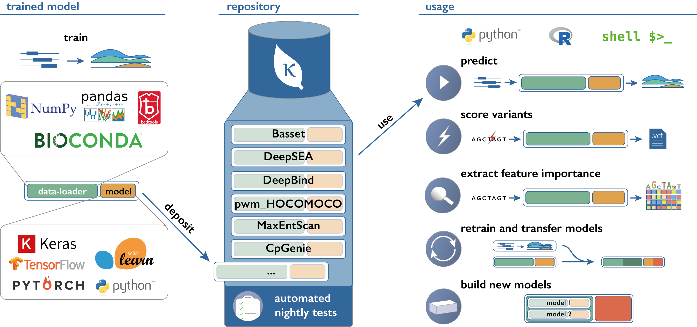

# Software libraries for model building

## gReLU

"<a href="https://github.com/Genentech/gReLU/blob/main/README.md" target="_blank">gReLU</a> is a Python library to train, interpret, and apply deep learning models to DNA sequences". The gRelu library contains a model zoo allowing for easy access to several models such as Borzoi, Enformer, or a dilated convolutional model based on the BPnet model architecture. Some of these models can be imported pre-trained. Additionally, simpler base models and convolutional neural networks are also available. On top of access to already built models, the software library allows for designing your own models.

Source: [gRelu](https://github.com/Genentech/gReLU/blob/main/README.md){target="_blank"}

 

Their <a href="https://genentech.github.io/gReLU/index.html" target="_blank">documentation</a> contains all their available functions and includes tutorials on using gRelu.

## Kipoi

<a href="https://kipoi.org/" target="_blank">Kipoi</a> is a repository of ready-to-use trained models for genomics. Referring back to the reproducibility of machine learning models, Kipoi contains 2206 different gold standard models, available to be downloaded and tested in a few lines of code. 

Source: [Kipoi](https://kipoi.org/docs/){target="_blank"}

 

Similarly to gRelu, they include several use case tutorials and a model zoo. Downloaded models can also be built upon to conduct further research as links to the github source code of each model are provided.
