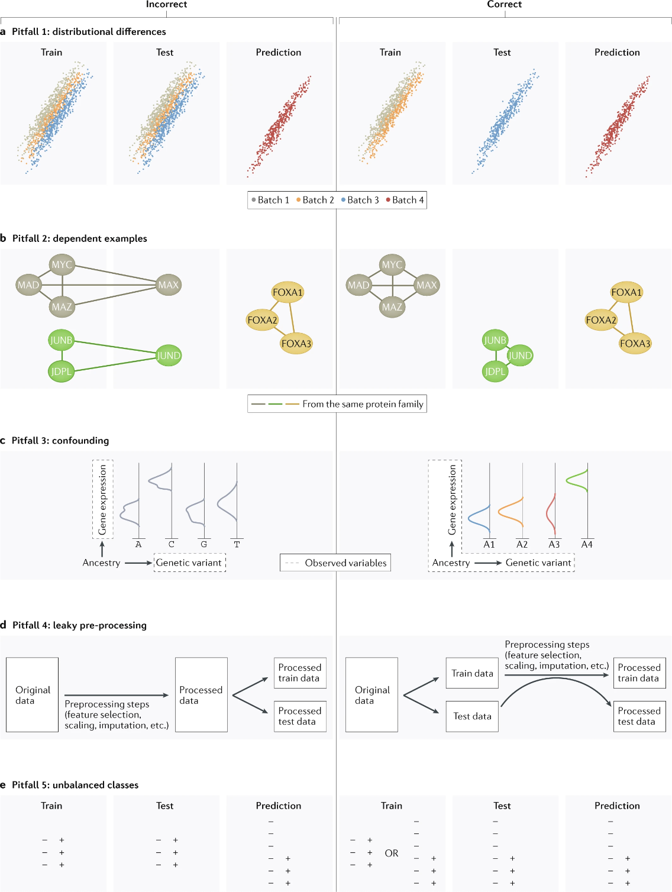

# (PART) ML pitfalls in genomics {-}

# Pitfalls overview

Applying machine learning in the field of genomics comes with its own challenges. Genomic data is highly complex, featuring high dimensionality, heterogeneity, and noise. It is important to consider the assumptions models make and whether those assumptions hold true within the data. According to research, available [here](https://www.nature.com/articles/s41576-021-00434-9){target="_blank"}, on pitfalls in machine learning, the most common errors include not taking into account distributional differences between contexts or batches, dependencies within the data, confounding effects distorting true relationships, unbalanced classes and leaking information between datasets.^[@whalen2022] Lets examine the pitfalls mentioned in the research above and methods to mitigate these effects in more detail.

Source: [Nature Reviews Genetics](https://www.nature.com/articles/s41576-021-00434-9/figures/1){target="_blank"}

 

**Distributional differences**

Distributional differences between the context in which a model was trained and tested, and the context in which a model makes predictions, results in different model performances. These different contexts can be attributed to batch effects or applying the model on different cell types. "One should expect that performance will be higher in [the same setting] than on [different settings]^[@whalen2022]. It is crucial then, for models which aim to predict biological relationships across contexts to be validated and tested across these different settings that accurately reflect the real-world variability. Even models that aim to predict across one context such as cell type-specific models common in disease prediction, are still susceptible to this pitfall. When using data from multiple experiments, batch effects can introduce variability that lead to differences between training, test, and prediction sets. To address this, it is important to consider batch effects during model development and evaluation. One approach is to ensure that training and test sets are sourced from different batches to evaluate the generalisability of the model and prevent inflated performance. Additionally, applying batch effect correction techniques such can help account for these distributional differences.
  

**Dependent examples**

When studying machine learning, a constant assumption is that of independence. Whether it be independent test sets or data points being independent of each other, the assumption of independence is key in creating fair models. Many biological processes in genomics are not independent.^[@allis2015] A research paper focused on understanding the pitfalls of neural networks predicting across cell types found that several models had been evaluated on test sets comprising of cell type independent of training, but not independent of chromosomes leading to inflated performances.^[@jacob2020] That is, gene expression predictions were evaluated on different cells but on the same chromosomes. The inflated performances were due to chromosomes "themselves [being] dependent across samples because the underlying functional activity is generally shared"^[@whalen2022]. While hard to identify in the designing phase even through visualisation, mitigation techniques include preventing overfitting during evaluation and group k-fold cross-validation to prevent leakage between training and test sets.^[@whalen2022]
  

**Confounding**

Confounders are additional variables that affect the variables being studied, resulting in models not capturing the correct relationships in the data.^[@mo2012] "Confounding in genetic studies can arise from unmodelled environmental factors and population structure, as well as other factors".^[@whalen2022] In the context of ATAC-Seq and chIP-Seq data, differences in the sequencing depth of the experiment can have a confounding effect on models if not handled. As explained in part 1, ATAC-Seq and chIP-Seq data consists of reads that are alligned to a reference genome and aggregated. The sequencing depth of the experiment refers to on average how many times a region was sequenced.^[@sims2014] A higher sequencing depth means a higher overall coverage level. If not accounted for, models using data of different sequencing depths are confounded. Similarly when predicting on a dataset with a different sequencing depth than the training set, the model would biased. While sequencing depth as a confounder can be more easily corrected by downsampling the raw reads from the dataset with higher sequencing depth, other confounding effects can be harder to account for. However, it is possible to use statistical tools such as PEER^[@oliver2012], Inter-sample Correlation Emended (ICE) and Surrogate Variable Analysis (SVA)^[@jen2010] to understand confounders in your dataset.
  

**Leaky pre-processing**

Leaky pre-processing involves information leaks between the training and test sets resulting in altered testing metrics. In genomics, as a result of many dependencies, pre-processing steps involving the dataset as a whole can introduce this bias. This includes standardisation techniques, supervised feature selection or principle component analysis, before splitting data into test splits.^[@whalen2022] A solution to this is to perform these transformations and analysis after data splits, preferably within cross-validation. Leaky preprocessing has been prevalent in various genomic fields, including microarray analysis, DNA methylation, gene expression studies, and more, often leading to misleading results.^[@whalen2022]
  

**Unbalanced classes**

Unbalanced datasets can be common in genomics often necessitating the use of statistical methods to validate the few positive instances amid vast amounts of data. In these cases, the pitfall is a model "learns most of the target concepts of the majority class and learns target concepts from the minority class poorly or not at all."^[@muk2014] This is particularly evident in disease related tasks where the focus is on a few disease causing genes or non-coding variants.^[@muk2014] Additionally, many experiments that implement conservative significance thresholds to determine true signals involve data imbalance, such as peak detection^[@oh2020], gene expression^[@avsec2021], and chromatin accessibility. The extensive size of the human genome exacerbates this issue when the areas of interest are small. Researchers address this imbalance by employing balancing algorithms that oversample the negative class and undersample the majority class. For instance, in training models to predict functional peaks from ChIP-seq or chromatin accessibility data, an approach might involve using all identified peaks along with a matching number of negative regions, thus effectively undersampling the majority class. For datasets with no such negative regions, researchers have to construct their own. While such imbalances are commonly discussed in classification, they also pose challenges in regression models predicting quantitative outcomes, where performance may be compromised in regions with sparse data, such as genomic areas or genes with low read counts in single-cell genomics studies.^[@whalen2022]

